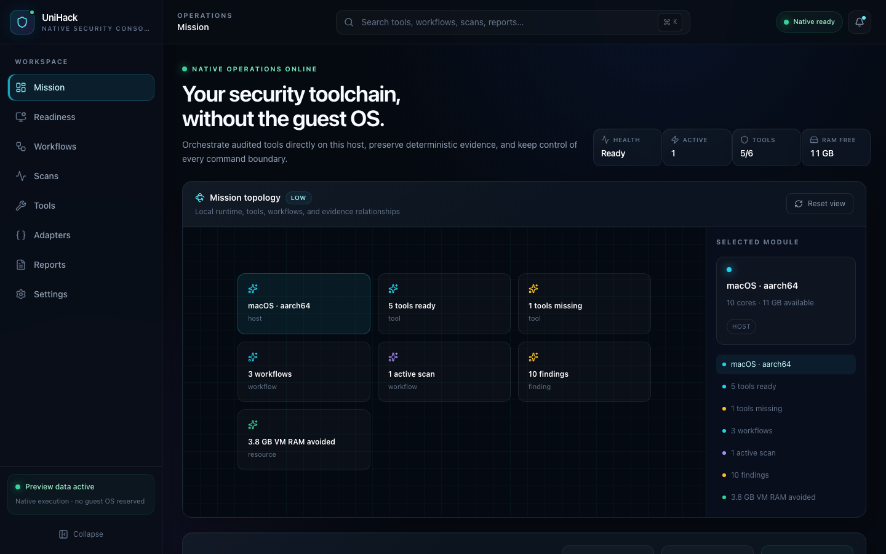
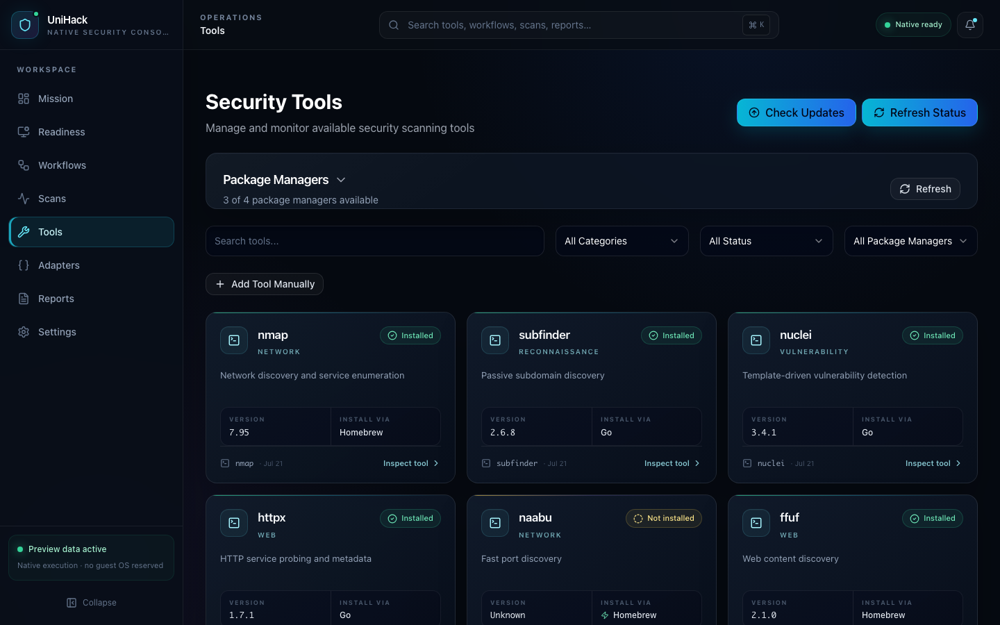
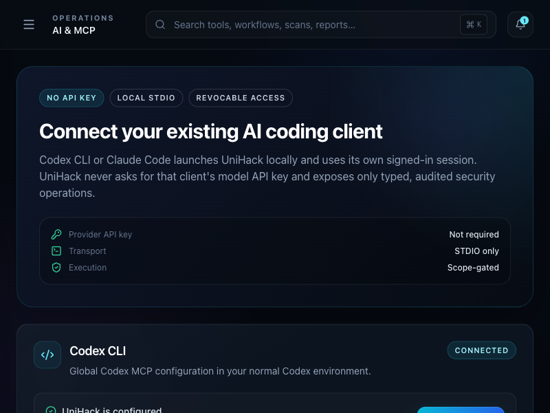
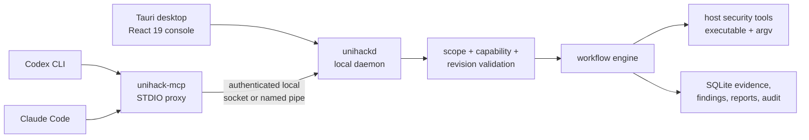

<p align="center">
  
</p>

<h1 align="center">UniHack</h1>

<p align="center">
  <strong>Your security toolchain, without the guest OS.</strong><br>
  A native-first desktop workbench for authorized security research on macOS,
  Windows, and Linux.
</p>

<p align="center">
  <a href="https://github.com/Jeevanbidgar/UniHack-Cross-Platform-Tool-Orchestrator/actions/workflows/ci.yml"></a>
  <a href="https://github.com/Jeevanbidgar/UniHack-Cross-Platform-Tool-Orchestrator/actions/workflows/release.yml"></a>
  
  <a href="LICENSE"></a>
</p>

<p align="center">
  <a href="https://github.com/Jeevanbidgar/UniHack-Cross-Platform-Tool-Orchestrator/releases"><strong>Download the beta</strong></a>
  ·
  <a href="docs/INSTALL.md">Install guide</a>
  ·
  <a href="docs/MCP_INTEGRATION.md">Connect Codex or Claude</a>
  ·
  <a href="docs/DEVELOPMENT_STATUS.md">Development status</a>
</p>

> [!WARNING]
> UniHack is for systems you own or are explicitly authorized to assess.
> The current beta installers are unsigned. Download only from this
> repository's Releases page and verify `SHA256SUMS.txt`.

## What UniHack does

Traditional security labs often keep an entire guest operating system running
to access a handful of command-line tools. UniHack orchestrates compatible
tools directly on the computer you already own, preserving evidence and process
controls without reserving RAM for a guest OS.

- Discovers installed tools, versions, package managers, and host readiness
- Offers 15 inspectable workflows for reconnaissance, network, web, API,
  WordPress, content-discovery, and vulnerability-assessment tasks
- Runs direct executable plus structured argument vectors—never arbitrary shell
  strings
- Streams progress, supports cancellation and timeouts, and stores scan state,
  artifacts, findings, and reports in SQLite
- Uses specialized and declarative tool contracts, with quarantined local
  auto-adapters for newly discovered CLI tools
- Exports HTML, JSON, and SARIF reports with integrity metadata
- Connects directly to Codex CLI and Claude Code through local STDIO MCP using
  the AI client's existing login—no OpenAI or Anthropic API key is given to
  UniHack
- Keeps execution bound to an immutable workflow revision and a
  desktop-approved engagement scope

UniHack is not a kernel virtualizer. Tools that require a different kernel,
privileged lab network, or unavailable runtime still need an appropriate
environment. Native execution is the only active runner in this beta.

## The console

<table>
  <tr>
    <td width="50%">
      
    </td>
    <td width="50%">
      
    </td>
  </tr>
  <tr>
    <td align="center"><sub>Adaptive mission topology and resource comparison</sub></td>
    <td align="center"><sub>Native tool discovery, readiness, and installation choices</sub></td>
  </tr>
</table>

<p align="center">
  
</p>

The React 19 interface is responsive from 800×600 through 4K. Immersive
visuals are lazy-loaded, power-aware, optional, and backed by accessible 2D
controls.

## Install the beta

Tagged releases produce separate native files on GitHub-hosted runners:

| Platform | Installer |
|---|---|
| macOS Apple Silicon | `UniHack-2.0.0-macos-arm64.dmg` |
| macOS Intel | `UniHack-2.0.0-macos-x86_64.dmg` |
| Windows x64 | `UniHack-2.0.0-windows-x86_64-setup.exe` |
| Debian/Ubuntu x64 | `UniHack-2.0.0-linux-x86_64.deb` |
| Linux x64 portable | `UniHack-2.0.0-linux-x86_64.AppImage` |

Download the matching file and `SHA256SUMS.txt` from
[GitHub Releases](https://github.com/Jeevanbidgar/UniHack-Cross-Platform-Tool-Orchestrator/releases),
then follow the [platform installation guide](docs/INSTALL.md).

## First useful run

1. Open **Readiness** and refresh the host inventory.
2. Install only the tools you need and understand. UniHack does not hide
   package-manager or operating-system privilege prompts.
3. Open **Workflows**, choose an outcome, and inspect its tool chain,
   prerequisites, arguments, and expected evidence.
4. Start the workflow from **Scans**, provide the exact authorized target, and
   confirm authorization.
5. Watch live progress, inspect retained artifacts and normalized findings, then
   export a report.

The packaged core covers Nmap, Subfinder, Nuclei, Naabu, Amass, HTTPX, FFUF,
Gobuster, GAU, Waybackurls, SQLMap, Nikto, WPScan, Feroxbuster, and Dalfox.
Tool binaries are not bundled; UniHack discovers or installs compatible upstream
tools on the host.

## Connect Codex CLI or Claude Code

UniHack exposes a local `unihack-mcp` server. Codex or Claude launches that
binary over STDIO and continues using its own signed-in account. There is no MCP
network port and no model-provider API key in UniHack.

The simplest setup:

1. Install and open UniHack.
2. Go to **AI & MCP**.
3. Use **Connect** for Codex CLI or Claude Code.
4. Create a narrow engagement containing the exact target, allowed workflows,
   expiry, risk tier, concurrency, runtime, and output budget.
5. Start a fresh Codex task or Claude Code session.

Manual Codex setup:

```bash
codex mcp add unihack -- /absolute/path/to/unihack-mcp
codex mcp get unihack
```

Manual Claude Code setup:

```bash
claude mcp add --transport stdio --scope user unihack -- /absolute/path/to/unihack-mcp
```

Then ask the client:

```text
Use UniHack for my existing authorized engagement. List the engagement and
compatible workflows, validate the target, run the selected immutable revision
with a new stable idempotency key, monitor it until terminal, and summarize only
evidence returned by UniHack. Do not expand scope.
```

The AI client cannot create or expand authorization, read credentials, submit a
raw shell command, suppress audit records, or bypass operating-system elevation.
See [MCP Integration](docs/MCP_INTEGRATION.md) for configuration snippets,
capabilities, and the complete execution flow.

## Architecture



`unihackd` owns scanner processes, cancellation, execution authority, and the
MCP execution path. The desktop still has some legacy read-only/data-management
commands to migrate behind the daemon before a stable release; this limitation
is tracked publicly in [Development Status](docs/DEVELOPMENT_STATUS.md).

More detail:

- [Architecture](docs/ARCHITECTURE.md)
- [Security model](docs/SECURITY_MODEL.md)
- [Current verified scope and remaining gates](docs/DEVELOPMENT_STATUS.md)

## Build from source

Requirements:

- Node.js 22 LTS
- Stable Rust
- Platform dependencies from the
  [Tauri prerequisites guide](https://v2.tauri.app/start/prerequisites/)

Install locked dependencies and start the desktop app:

```bash
git clone https://github.com/Jeevanbidgar/UniHack-Cross-Platform-Tool-Orchestrator.git
cd UniHack-Cross-Platform-Tool-Orchestrator
npm ci
npm ci --prefix frontend
npm run dev
```

Build a local bundle with target-specific `unihackd` and `unihack-mcp`
sidecars:

```bash
npm run build
```

The repository does not contain signing credentials. Tagged builds use
[the beta installer workflow](.github/workflows/release.yml) to produce native
unsigned packages for all four supported targets.

## Current beta boundary

Working now:

- desktop discovery, tools, readiness, packaged workflows, scans, artifacts,
  findings, reports, notifications, settings, and adaptive visuals
- daemon-owned MCP discovery and engagement-scoped execution
- local Codex CLI / Claude Code connection without a provider API key
- macOS, Windows, and Linux packaging automation

Still required before a stable release:

- finish exclusive daemon ownership for older desktop data commands
- move editable Workflow Studio drafts to backend-owned immutable revisions
- native sidecar/client smoke tests on every packaged OS
- operating-system signing/notarization and a stable update channel
- project workspaces, evidence diffing, and broader structured parsers

This distinction is intentional: the beta is useful for authorized local
testing, but it is not being represented as a finished production release.

## Contributing and feedback

Use [GitHub Issues](https://github.com/Jeevanbidgar/UniHack-Cross-Platform-Tool-Orchestrator/issues)
for reproducible bugs and platform compatibility reports. Include the operating
system, UniHack version, route/action, expected result, and redacted logs.

Never post credentials, tokens, customer data, private targets, or raw
vulnerability evidence in a public issue. Security-sensitive reports should use
GitHub's private vulnerability reporting when available.

## License

[MIT](LICENSE) © 2026 Jeevan Bidgar
